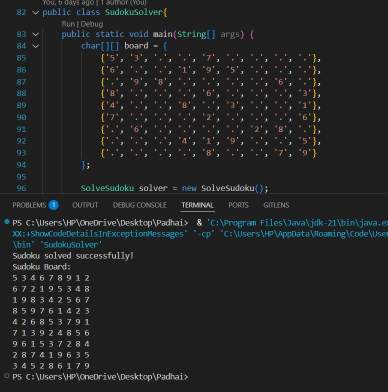

# Sudoku Solver

A Java-based application to solve Sudoku puzzles using a backtracking algorithm. This project demonstrates problem-solving using recursion and constraint satisfaction techniques.

## ✨ Features

- Solves standard 9x9 Sudoku puzzles
- Uses backtracking algorithm
- Command-line interface for input/output
- Well-structured and object-oriented Java code

## 📸 Demo



## 🚀 Installation

1. Clone the repository:
   ```bash
   git clone https://github.com/yourusername/Suduko_Solver.git
   cd Suduko_Solver
   ```

2. Compile the code:
   ```bash
   javac SudokuSolver.java
   ```

3. Run the program:
   ```bash
   java SudokuSolver
   ```

## 🧠 How It Works

The Sudoku solver uses a backtracking algorithm which follows these steps:

1. We start with the first empty cell.
2. We generate a list of possible valid values that can be filled in that cell.
3. We iterate over this list and start with the first value. This value is placed in the required cell.
4. We move on to the next cell. We again generate a list of possibilities. However, if no list can be generated, then this means that there is something wrong with the value of the previous cell. We then move back to the previous cell and place the next value on the generated list in the cell now. We repeat this step until the current cell has a valid value placed inside it.
5. We stop when we reach the 81st cell (the last cell in a Sudoku puzzle) and have placed a valid value.
6. The puzzle has now been solved.

## 🤝 Contributing

Contributions are welcome! Feel free to open issues or submit pull requests for improvements or new features.